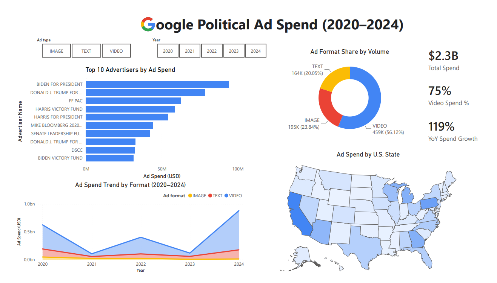

# Google Political Ad Spend Intelligence | 2020–2024
### A Platform Analytics Study of $2.3B in U.S. Political Advertising


---

## Why This Project

Political advertising on Google is one of the few places where real media spend data is publicly available. Most ad data is locked behind proprietary walls, but Google's Political Ads Transparency dataset gives you actual spend figures, format breakdowns, and geographic targeting data across every U.S. election cycle since 2018.

I wanted to treat this data not as a political story, but as a platform intelligence problem. How do organizations actually use Google's ad ecosystem? Where do they spend? What formats do they choose? And how does that behavior shift when an election is on the line?

That question drove everything in this project.

---

## Business Questions

1. Which advertisers dominated Google political ad spend from 2020 to 2024?
2. Which ad format (Video, Text, or Image) commands the largest share of spend and volume?
3. How has total ad spend trended across the 2020, 2022, and 2024 election cycles?
4. Which U.S. states are most heavily targeted, and does geography align with known battleground states?
5. What is the cost premium of Video over other formats, and does advertiser behavior reflect that premium?

---

## Data Source and Extraction

**Source:** Google Political Ads Transparency Dataset  
**Location:** `bigquery-public-data.google_political_ads`  
**Access:** Google BigQuery public dataset, directly queryable via SQL with no download or API key required  
**Scope:** U.S. only, 2020 to 2024, approximately 926,000 ad records

### Why BigQuery instead of Kaggle?

Most portfolio projects rely on pre-packaged CSV files. This project queries Google's live transparency dataset directly, the same source used by journalists and academic researchers. That meant understanding BigQuery's public dataset structure, exploring the schema using INFORMATION_SCHEMA before writing a single analysis query, and making deliberate decisions about which tables to use and how to aggregate data efficiently before export.

It also meant dealing with real data quality issues, which I would not have encountered with a cleaned Kaggle file.

---

## Analytical Approach

### Step 1: Schema Exploration

Before touching the data, I ran schema exploration queries using INFORMATION_SCHEMA.COLUMNS across three core tables to understand what fields were actually available:

- `creative_stats` covers ad-level spend, format, and targeting
- `advertiser_stats` covers advertiser-level totals
- `advertiser_weekly_spend` covers weekly spend by cycle (found to be largely deprecated, so I excluded it and rebuilt the time series from creative_stats instead)

### Step 2: Data Quality Check

I ran null-count checks across all key columns before extraction. Geographic targeting came back at 97% completeness, which was acceptable for the map visual. I also discovered that the regex pattern I initially used to extract U.S. state names was pulling in international locations like Argentina, Vietnam, and the UK. I replaced the pattern with a strict U.S. state whitelist filter to clean this up at the source rather than patching it downstream.

### Step 3: Aggregation in BigQuery Before Export

Rather than exporting raw rows and cleaning in Power BI, I aggregated everything in BigQuery first. This brought file sizes down from 1.6GB to under 100MB and meant Power BI received clean, analysis-ready tables. I exported four targeted CSVs covering advertiser spend by format, monthly spend trends, geographic targeting by state, and format-level efficiency metrics.

### Step 4: DAX Measures in Power BI

I built three custom DAX measures to add analytical depth beyond what the raw columns could show:

```dax
-- Total spend formatted for readability
Total Spend = 
"$" & FORMAT(SUM('table1_advertiser_adtype csv'[avg_spend_estimate])/1000000000, "0.0") & "B"

-- Video's share of total ad spend
Video Spend % = 
FORMAT(
    DIVIDE(
        CALCULATE(SUM('table1_advertiser_adtype csv'[avg_spend_estimate]), 
        'table1_advertiser_adtype csv'[ad_type] = "VIDEO"),
        SUM('table1_advertiser_adtype csv'[avg_spend_estimate])
    ) * 100, "0") & "%"

-- Spend growth comparing 2024 presidential cycle vs 2022 midterms
YoY Spend Growth = 
VAR Year2024 = CALCULATE(
    SUM('table2_monthly_trend csv'[total_spend_max]),
    'table2_monthly_trend csv'[Year] = 2024)
VAR Year2022 = CALCULATE(
    SUM('table2_monthly_trend csv'[total_spend_max]),
    'table2_monthly_trend csv'[Year] = 2022)
RETURN FORMAT(DIVIDE(Year2024 - Year2022, Year2022, 0) * 100, "0") & "%"
```

---

## Key Insights

- **$2.3B** was spent on Google political ads across 4 election cycles from 2020 to 2024
- **Video is king** -- 75% of all ads are video, even though it costs 6.7x more per ad than image
- **2024 was the biggest spending year on record** at ~$900M, 119% higher than the 2022 midterms
- **Spend spikes with every election** -- 2020, 2022, and 2024 all show clear jumps in the trend
- **Battleground states get the most ads** -- Pennsylvania, Georgia, Michigan, and Arizona dominate geographic targeting, exactly where elections are decided
- **A small group drives most of the spend** -- the top 10 advertisers account for a disproportionate share of the total $2.3B

---

## Tools and Stack

| Tool | Purpose |
|---|---|
| Google BigQuery | Queried Google's public Political Ads dataset directly using SQL |
| SQL | Schema exploration, null checks, aggregation, and geo filtering |
| Power BI Desktop | Data modeling, dashboard design, and interactive visualizations |
| Power Query | Data type standardization and Year column extraction from date field |
| DAX | Custom KPI measures for Total Spend, Video Share, and YoY Growth |

---

## Dashboard Features

- Interactive tile slicers to filter by Ad Type and Year
- Google-branded color palette with consistent encoding across all visuals
- Shape map showing spend intensity by U.S. state
- Stacked area chart showing election cycle spend trends by format
- DAX-powered header stats for Total Spend, Video Share, and YoY Growth

---

## Dashboard Preview



---

## Live Dashboard

To explore the interactive dashboard, download the `google_ad_spend.pbix` file and open it in Power BI Desktop (free to download at powerbi.microsoft.com/desktop).

---

## Project Files

| File | Description |
|---|---|
| `google_ad_spend.pbix` | Power BI report file |
| `table1_advertiser_adtype.csv` | Advertiser spend by format |
| `table2_monthly_trend.csv` | Monthly spend trend by format |
| `table3_geo_clean.csv` | Ad spend by U.S. state |
| `table4_adtype_efficiency.csv` | Format-level cost efficiency |
| `README.md` | Project documentation |
